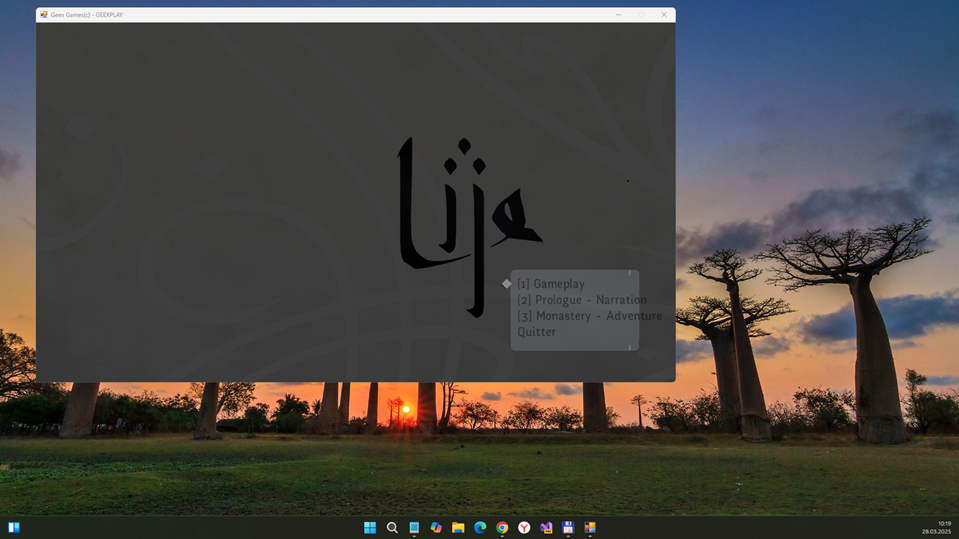
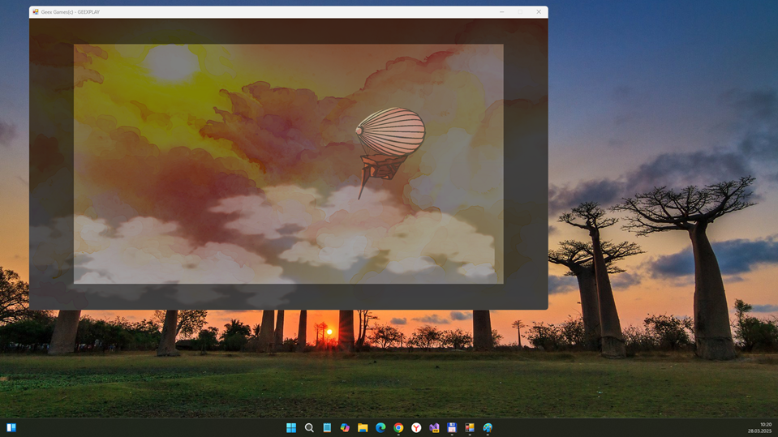

# Lije x.x.x.x - main branch 

Quick and dirty R.E. of veery unpopular Lije game... 

## About
"Making her way through the everlasting mists of a strange country, a young woman strives to stray from the path that has been chosen for her by men, societies and gods.

Lije is a 2D RPG, inspired both by japanese (strong characters) and western tradition (freedom of action in a coherent environment).

<...>

In Lije's world, beliefs shape reality. Should a rumor spread enough, that it would materialize. On the other hand, should a person be too isolated, a place only to exist in the minds of a few old people then it would disappear in the permanent mist that bathes the world: Rim. The player will explore this dangerous place and will be able to use its unique features: they will refresh and use peoples memories, will pull back forgotten places from Rim, will turn to mist any obstacle that would stand in their way."

## Screenshots

## My 2 cents
- Game setup fixed, app installed and [D]ot[P]eeked"
- C# 12.0 language constructions substituted by normal C# (for better VS 2017 compatibility)
- .NET 4.0 - .NET 4.8 upgrade :)

## Tech details
- It's only "technical demo" (3 of 5 planned parts, and part 1 seems to be incomplete!). 
- Original game has french interface, but english binary is also exists...   
- Usability my reversed src code: very unstable, 100500 bugs still here (init state... game cache/storage damaged)
- .NET 4.8 used

## How to build this project? Where is game content?
- Download original setup archive, unzip and find original Contents folder. 
- Look at /Src/Lije/Content. Find del2.bat file, place it in original Contents folder, and use this bachfile to delete second (.deploy) extension.
- Then copy the result into Contents folder. Then try to build app.

## ToDo
- Solve Xna.Framework.Storage.dll mystery (is it oblsolete part of Monogame engine??)
- Realize normal screen scaling ...
- try to construct "uwp edition" :)

## Reference(s)
- https://rufflerim.itch.io/lije Lije, "frozen" original project (it is on hold more then 7 years)
- https://www.youtube.com/watch?v=IcPtGkVjMNo Yet Unpopular Indie Game (Part 1)
- https://www.youtube.com/watch?v=rVyxEH7SX3U Yet Unpopular Indie Game (Part 2)
- https://www.youtube.com/watch?v=4OVXCXL7jPg Yet Unpopular Indie Game (Part 3)

## .
As is. No support. DIY. Learn purposes only.

## ..
[m][e] March 2025
